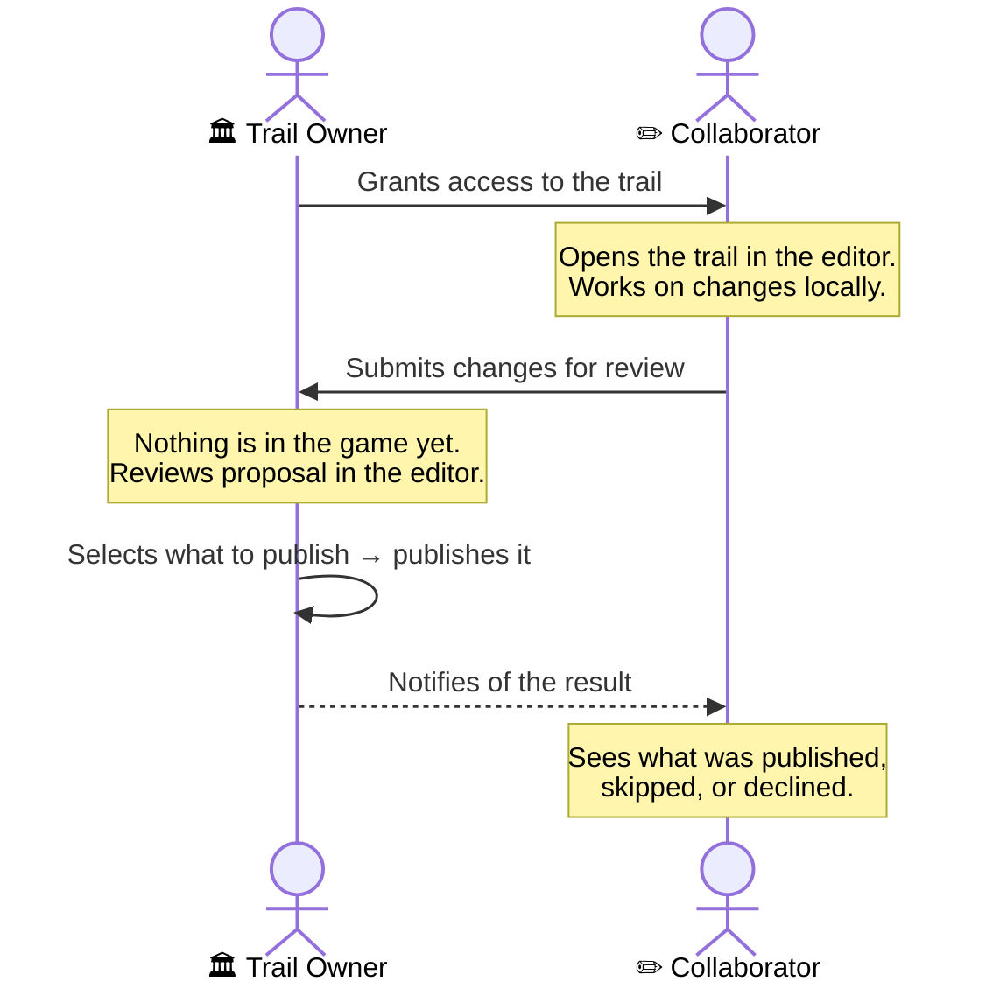

# Collaborative World-Building in O'RuggEd

Trails are worlds you own. The collaborative feature lets other players help you build inside them — proposing new rooms, descriptions, puzzles, and more — while you decide exactly what makes it in.
  
Nothing a collaborator creates ever enters your trail without your direct approval.

---
## The idea in one sentence

> A collaborator proposes changes. You review and publish what you like. They get notified of the result.

That's the full loop. No surprises, no unauthorized edits, full control on both sides.

---
## How it works

### Step by step

**1. Owner grants access**
The trail owner invites a player by wallet address. From that moment, the collaborator can open the trail in their editor — but they cannot publish anything directly. The gate is built into the game; it cannot be bypassed.

**2. Collaborator builds and stages changes**
The collaborator works on the trail just like they would on their own: adding entities, writing descriptions, setting up interactions. Everything stays in their local editor until they're ready to propose.

  
**3. Collaborator submits for review**
When ready, the collaborator hits **Submit for review**. Their staged changes are sent as a proposal. At this point, none of it has entered the game — it's a draft waiting for the owner's decision.

**4. Owner reviews the proposal**
The proposal appears in the owner's **Remote Changes** panel. The owner can expand each entity and see every component being added, modified, or removed, down to individual descriptions, exits, and interactions.

  
**5. Owner publishes their selection**
The owner checks the items they want to include and clicks **Publish selected**. Only the checked items go live. The owner can accept some changes and skip others — they're never forced to take everything or nothing.
  
New entities proposed by the collaborator will list the collaborator as their creator on-chain, even though the owner is the one publishing them.

**6. Collaborator receives the result**
A notification appears in the collaborator's editor. They see how much of their work was included. If something was skipped, their staged changes are preserved — they can revise and resubmit at any time.

---
## For trail owners

| **What you need to do**             | **Where**                          |
| :---------------------------------- | :--------------------------------- |
| Grant a player access to your trail | Editor → Collaboration settings    |
| See incoming proposals              | Remote Changes panel               |
| Review individual components        | Expand each entity in the proposal |
| Accept or skip items                | Check / uncheck per component      |
| Publish selected changes            | "Publish selected (N)" button      |
| Revoke access later                 | Editor → Collaboration settings    |

**Things to know:**

- You can approve some of a collaborator's changes and skip others — it's never all-or-nothing

- You are the one calling the publish action, so you pay the transaction fee for what goes live

- The collaborator is notified automatically once you publish; no need to message them separately

- You can revoke a collaborator's access at any time without affecting what's already been published

---
## For collaborators

| **What you need to do** | **Where**                                              |
| :---------------------- | :----------------------------------------------------- |
| Receive the invite      | From the trail owner (they add your wallet address)    |
| Open and edit the trail | Editor — it appears as editable once access is granted |
| Stage your changes      | Staging panel → Stage / Stage all                      |
| Send your proposal      | Staging panel → "Submit for review"                    |
| See the result          | Notification toast / banner in your editor             |
| Revise and resubmit     |  Edit staged changes, submit again                     |
 
**Things to know:**

- The "Publish staged" button is disabled for trails you don't own — use "Submit for review" instead

- Your changes don't appear in the game until the owner publishes them

- If your proposal is declined or only partially accepted, your staged work is preserved exactly as it was — nothing is lost

- Each new submission replaces the previous proposal the owner sees, so you can revise freely between submissions

---
## What the collaborator sees after a review

| Result                      | What it means                                                                                                                                    |
| --------------------------- | ------------------------------------------------------------------------------------------------------------------------------------------------ |
| ✅ **All changes published** | The owner accepted your full proposal. Everything is now live.                                                                                   |
| ⚠️ **Partially published**  | Some changes went in, others were skipped. You'll see the count. Your staged changes are still there if you want to revise and propose the rest. |
| ✕ **Proposal not accepted** | Nothing was published this time. Your work is fully preserved. Edit your staged changes and resubmit whenever you're ready.                      |

---
## Common questions

**Can I collaborate on more than one trail at the same time?**
Yes. You can be a collaborator on as many trails as you're invited to, and own as many trails as you hold tokens for. Each trail's proposals and notifications are completely independent.

**Can a collaborator delete things from my trail?**
A collaborator can propose removing individual components from an entity — an exit, a description, a reactable. The owner decides whether to include those deletions when publishing. However, collaborators cannot propose deleting entire entities; that is reserved for trail owners.

**What if I want to resubmit after my proposal was skipped?**
Your staged changes are never erased by a declined or partial review. Go back into the editor, adjust whatever you like, and hit Submit for review again. Each new submission replaces the old one.

**Who is credited as the creator of a new entity I propose?**
You are — even though the owner publishes it. New entities carry your wallet address as creator on-chain. Changes to existing entities always preserve the original creator's credit.

**Can the owner see my work before I submit?**
No. Everything you build stays in your local editor until you explicitly click "Submit for review." The owner only receives the proposal at that moment.

**Does the owner have to accept the entire proposal or nothing?**
No — the owner has per-component control. They can accept changes to one entity while skipping another, or include a room's area data but skip its written description. The notification you receive will tell you exactly what was included.