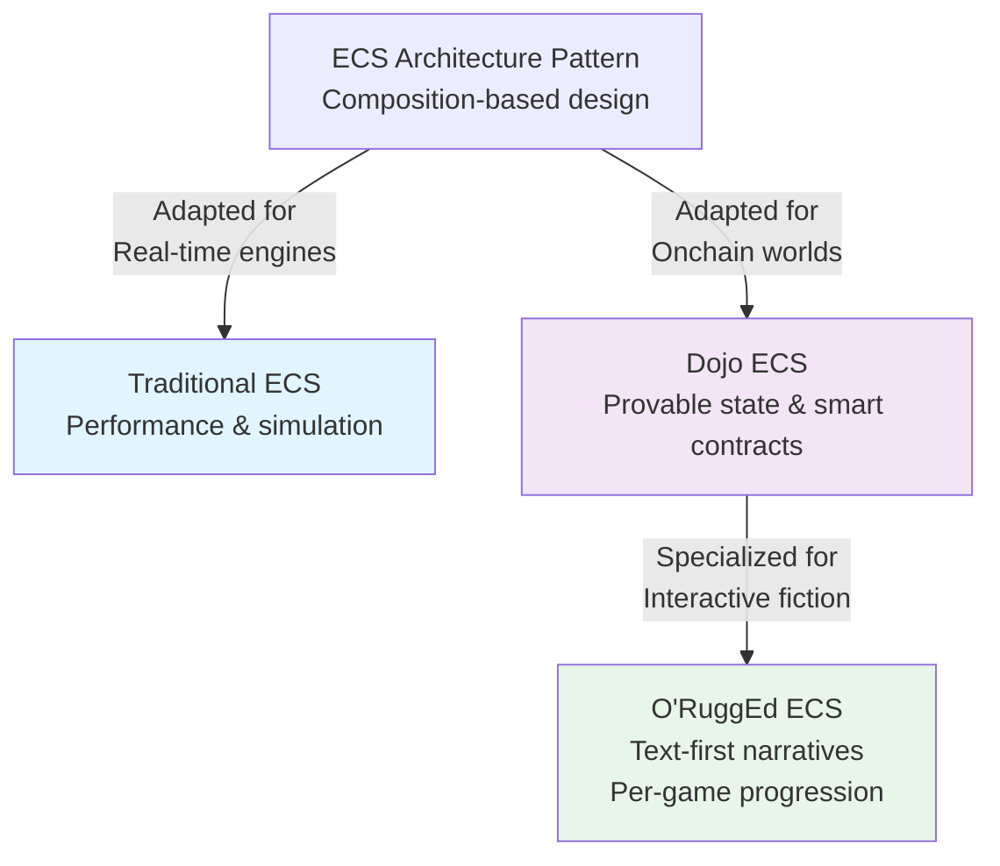
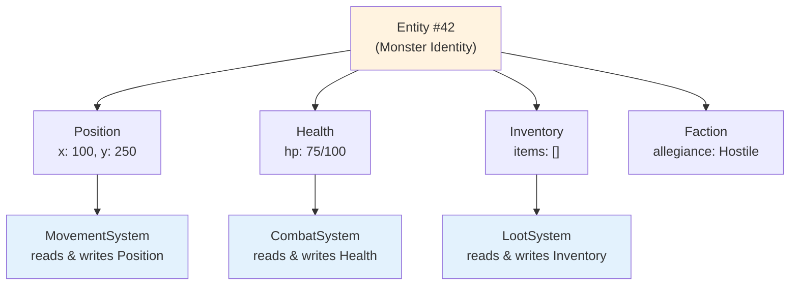
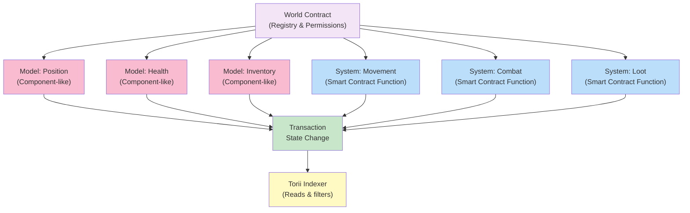
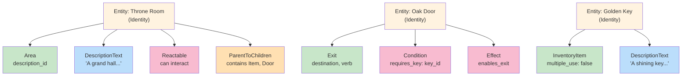
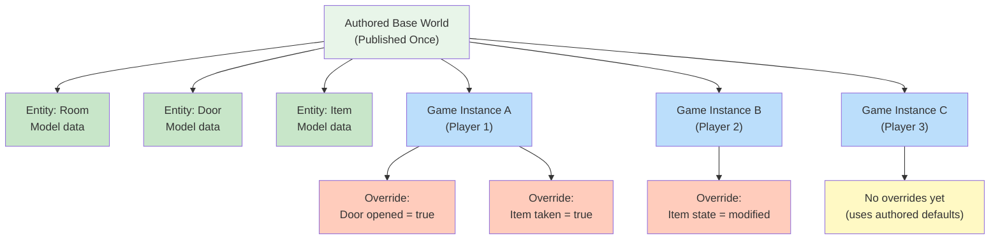
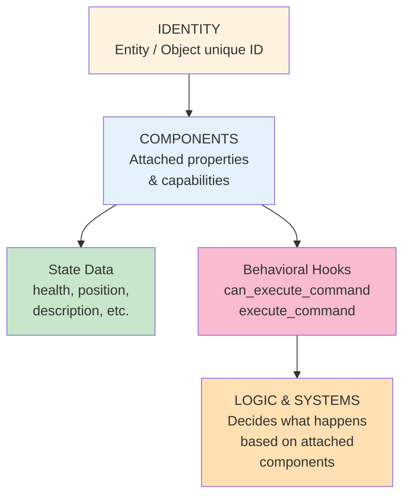
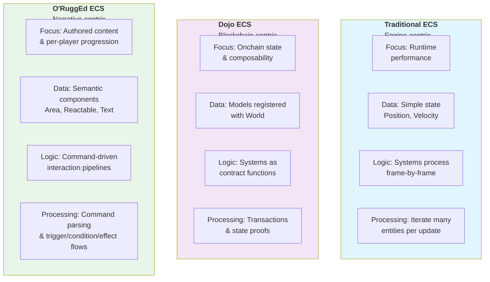
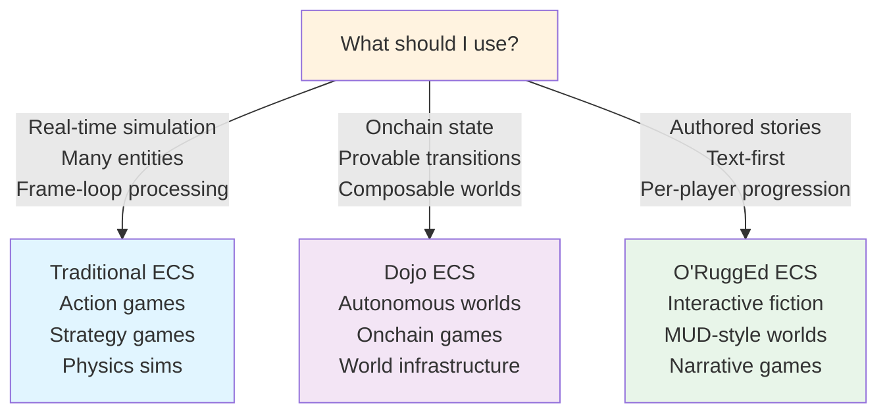

# Traditional ECS, Dojo ECS, and O'RuggEd ECS

This document explains three related but distinct ideas:

1. traditional ECS as it is usually described in game architecture
2. Dojo's ECS-style model for onchain worlds on Starknet
3. O'RuggEd's ECS implementation as it is used in this repository

The goal is not only to define each one, but also to show where they overlap, where they diverge, and what each one is best suited for.

  
## Overview: Three ECS Approaches

## 1. Traditional ECS

In the traditional Entity Component System pattern:

- an `Entity` is an identity, usually just an id
- a `Component` is data attached to that entity
- a `System` is logic that reads and writes components

The core idea is separation of concerns:

- entities do not contain gameplay logic
- components usually do not contain behavior, only state
- systems are the place where behavior happens

### Traditional ECS mental model

If we describe a monster in classic ECS terms:

- `Entity`: monster #42
- `Components`: `Position`, `Health`, `Inventory`, `Faction`
- `Systems`: `MovementSystem`, `CombatSystem`, `LootSystem`

The monster is not a class like `Monster extends Character`.
It is the combination of components currently attached to entity `42`.

  

  

### Why traditional ECS exists

Traditional ECS is usually adopted because it helps with:

- composition instead of inheritance
- reuse of small data modules
- processing many entities efficiently
- clean separation between state and logic

This is especially common in simulation-heavy or real-time games, where systems iterate over large groups of entities every frame.

  
### Strengths of traditional ECS

- very modular
- easy to add new combinations of behavior
- scales well when many objects share the same processing rules
- often good for data-oriented performance
  

### Limitations of traditional ECS

- it can feel abstract for authored content tools
- relationships like nested world objects can require extra modeling work
- text, rules, and authored interaction pipelines often need higher-level patterns on top
- the strict "components are only data" rule is not always how production systems evolve in practice

## 2. Dojo's ECS Definition

According to the official Dojo framework documentation, Dojo is a framework for building provable games and autonomous worlds on Starknet, and it uses ECS architecture as a core design pattern:

Reference: <https://book.dojoengine.org/framework>

Dojo explains ECS in familiar terms:
  
- `Entities`: the objects in the application
- `Components`: the properties of those objects
- `Systems`: the rules that operate on them

Dojo then adapts that pattern to an onchain environment with three main building blocks:

1. `Models`
2. `Systems`
3. `World`

  
### How Dojo maps ECS concepts

In Dojo terminology:

- `Models` are the component-like data structures
- `Systems` are smart contract entrypoints that implement logic
- the `World` contract is the shared registry and coordination layer

So the rough mapping is:

- traditional `components` -> Dojo `models`
- traditional `systems` -> Dojo contract systems
- traditional entity id -> usually a model key shared across related models

  

### Important characteristics of Dojo ECS

Dojo's version of ECS is shaped by blockchain constraints and opportunities:

- state is stored onchain
- state transitions happen through transactions
- permissions matter
- indexing matters
- schema introspection matters
- upgrade paths matter

From the Dojo docs, the `World` is central because it manages models, systems, permissions, metadata, and writes.

That means Dojo is not only an ECS runtime pattern. It is also a deployment, authorization, and indexing architecture for onchain applications.

### What makes Dojo different from a typical engine ECS

Compared with a classic engine ECS, Dojo emphasizes:

- verifiable state changes
- contract-based system execution
- automatic indexing through Torii
- explicit world registration and permissions
- composability across onchain applications

A real-time game engine might care most about memory layout and frame-loop performance. Dojo cares more about correctness, composability, persistence, and provability in an onchain world.

  

## 3. O'RuggEd ECS

O'RuggEd is built on Dojo, but it applies ECS to a very specific domain: authored, text-first, interactive fiction worlds with persistent per-game progression.

### O'RuggEd's basic ECS interpretation

In O'RuggEd:

- an `Entity` is the stable identity of a world object
- components attach capabilities and state to that entity
- the runtime decides what can happen based on which components are present

Examples:

- a room is usually `Entity + Area + Reactable + DescriptionText`
- a door or path is usually `Entity + Exit + Reactable + DescriptionText`
- an inspectable object is usually `Entity + Reactable + DescriptionText`
- an item is usually `Entity + Reactable + DescriptionText + InventoryItem`
- a container item is usually `Entity + Reactable + DescriptionText + Container`
- a puzzle object can combine `other components + Trigger + Condition + Effect + Action`

  

So O'RuggEd is clearly ECS-like in its composition model.

  

  

### What O'RuggEd adds on top of Dojo

O'RuggEd is not just "Dojo with different model names". It adds a domain-specific architecture for interactive fiction.

Important additions include:

- authored world structure
- parent/child containment hierarchy
- text descriptions as first-class content
- command parsing and command routing
- action pipelines made of `Trigger`, `Condition`, `Effect`, and `Action`
- per-game-instance overrides of authored state
- publishing and trail organization for discoverable worlds
  

### Core O'RuggEd entity model

`Entity` in O'RuggEd is not only an abstract id.

It is also an authored object record with fields such as:

- `inst`
- `name`
- `trail_id`
- `creator_address`
- `alt_names`
- `actions_keys`

It also participates in hierarchy through:

- `ParentToChildren`
- `ChildToParent`

This means O'RuggEd entities are both ECS identities and authoring-facing world objects.

### Components in O'RuggEd
  
O'RuggEd uses many Dojo models as components, including:

- `Area`
- `Exit`
- `Reactable`
- `InventoryItem`
- `Container`
- `Player`
- `DescriptionText`
- `Trigger`
- `Condition`
- `Effect`
- `Action`

  
Some of these are simple single-instance components keyed by `inst`.
Others are multi-key records keyed by `(inst, key)`, such as:
  
- `DescriptionText`
- `Trigger`
- `Condition`
- `Effect`
- `Action`

That gives O'RuggEd a more authored and graph-like structure than a minimal ECS example.

  
### Systems in O'RuggEd

O'RuggEd has contract systems, but its behavior is not organized exactly like a traditional ECS with many broad query systems such as "movement system" or "physics system".

  
Instead, O'RuggEd has high-level systems such as:

- `designer`: authoring and mutation entrypoints
- `prompt`: player command entrypoint

Then much of the interaction logic is distributed across model implementations and helper libraries.

For example:

- components implement `can_use_command(...)`
- components implement `execute_command(...)`
- actions coordinate triggers, conditions, and effects
- prompt execution flows through command parsing and handler logic

So O'RuggEd keeps the ECS composition model, but it is less "pure system-oriented" than textbook ECS.

### Per-game instance state is one of O'RuggEd's biggest differences

One of the most distinctive parts of O'RuggEd is the `game_instance.cairo` layer:

  
- authored base models are stored once
- game-specific versions can be mapped per `game_id`
- reads can return the authored default or a game-specific override
- writes can fork only the data needed for a particular playthrough

This is extremely important for interactive fiction.

It allows:

- one authored world
- many player-specific or run-specific states
- persistent progression without duplicating the entire authored dataset  

That is not a standard emphasis in classic ECS explanations, and it is not the whole focus of Dojo's basic ECS introduction either.

It is a strong O'RuggEd-specific adaptation.

  

  

## 4. Similarities

Traditional ECS, Dojo ECS, and O'RuggEd ECS all share a common foundation.

### Shared ideas

- they all separate identity from attached data
- they all use composition instead of large inheritance trees
- they all let the same entity gain meaning from the set of components attached to it
- they all support reuse of the same component types across many entity kinds
- they all benefit from modular logic and state organization

### Shared structural pattern

At a high level, all three can still be described as:
  
- identity
- attached properties/capabilities
- logic that acts on those properties/capabilities

That is why it is fair to call O'RuggEd an ECS-based project.

  

## 5. Differences

The differences are where the comparison becomes useful.

### Traditional ECS vs Dojo ECS
  
Traditional ECS usually focuses on engine architecture. Dojo ECS focuses on onchain world architecture.

Traditional ECS usually emphasizes:

- runtime performance
- frame-by-frame processing
- data-oriented iteration

Dojo emphasizes:

- onchain state
- permissioned writes
- transaction boundaries
- indexable model changes
- world-level resource coordination

### Dojo ECS vs O'RuggEd ECS

Dojo gives the foundational pattern. O'RuggEd gives a specific application of that pattern for interactive fiction.

Dojo's official framing is broad and generic:

- models
- systems
- world 

O'RuggEd narrows that into:

- authored entities
- text-centric components
- command-driven interaction
- per-playthrough state overlays
- puzzle and narrative logic pipelines

### Traditional ECS vs O'RuggEd ECS

This is the biggest conceptual difference. Traditional ECS often treats components as mostly passive data and systems as the main home of behavior. O'RuggEd is more hybrid.
  
In O'RuggEd:

- component modules often contain behavior methods
- command applicability can be checked per component
- command execution can be implemented per component
- interaction logic is closely tied to authored object capabilities

That makes O'RuggEd more practical for content authoring, but less strict than a textbook "components are data only" interpretation.

  
### O'RuggEd is more authored and semantic

Classic ECS examples often use components like:

- `Position`
- `Velocity`
- `Health`

O'RuggEd uses components like:

  

- `Area`
- `Reactable`
- `DescriptionText`
- `Trigger`
- `Condition`
- `Effect`
- `Action`

Those are not only low-level state containers.
They encode world semantics and narrative interaction patterns.

  
### O'RuggEd has explicit containment and authored topology

Traditional ECS often models spatial relationships through coordinates and systems.
O'RuggEd often models world structure through hierarchy:

- rooms contain objects
- players move between authored areas
- items can be children of rooms, players, or containers

This fits interactive fiction much better than a coordinate-first simulation model.

## 6. Best Applications

Each model shines in a different context.

  

### Traditional ECS is best for

- simulation-heavy games
- real-time gameplay loops
- many homogeneous entities updated frequently
- performance-sensitive runtime architectures

Typical applications:

- action games
- strategy games
- roguelikes with many simultaneous entities
- physics or AI-heavy simulations

### Dojo ECS is best for

- autonomous worlds
- provable onchain games
- applications that need composable world state
- systems that benefit from indexing, permissions, and smart-contract modularity

Typical applications:

- onchain strategy games
- persistent world state machines
- autonomous world infrastructure
- Starknet-native game backends

### O'RuggEd ECS is best for
  
- interactive fiction
- text adventure worlds
- authored quest spaces
- puzzle sequences made from reusable interaction parts
- persistent narrative worlds with per-player progression
  

Typical applications:

- Zork-like adventures
- MUD-inspired command worlds
- narrative exploration games
- onchain story experiences with discoverable hubs and trails

## 7. The Short Version

If we compress everything into one sentence each:

- traditional ECS is a composition pattern for organizing game state and logic
- Dojo ECS is an onchain adaptation of ECS built around models, systems, and a world contract
- O'RuggEd ECS is a Dojo-based, text-first, authored-world ECS adapted for interactive fiction and persistent game-instance progression

## 8. Practical Conclusion

O'RuggEd should be understood as an ECS-inspired and Dojo-based architecture, but not as a strict textbook ECS implementation.

It keeps the core ECS strengths:

- composition
- modular capabilities
- separation of identity and attached data

But it deliberately bends the pattern toward the needs of narrative world authoring:

- semantic components instead of only low-level state
- command-driven interaction instead of frame-loop iteration
- authored hierarchy instead of only coordinate-space relations
- game-instance overlays instead of one global static world state

  
That combination is exactly what makes O'RuggEd useful for onchain interactive fiction.