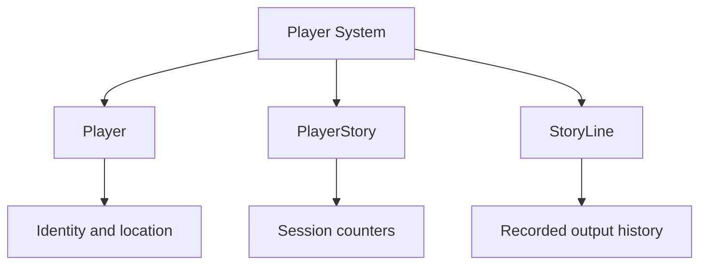
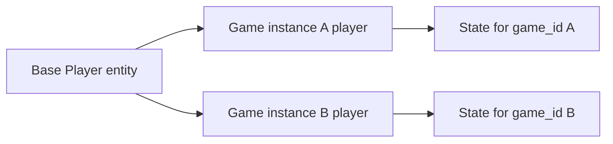
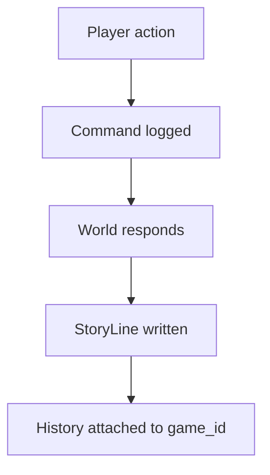

# Player System

The LORE player system defines how a player exists in the world, how a play session is tracked, and how game output is recorded over time.

In the contracts package, this system is centered on the models and logic in `player.cairo`. At a high level, the file does not only define a player character. It also defines the relationship between a player, a game instance, and the running story log for that session.

## Overview

The player system in LORE combines three responsibilities:

- representing the player as an entity in the world
- tracking per-game player state such as location and status
- recording the evolving story output of a play session

This means the player system is both a world-state model and a session-state model.

## System Diagram
  

## Core Structures

`player.cairo` defines three central models:

- `Player`
- `PlayerStory`
- `StoryLine`

Together, these form the basis of player presence, progression, and output history.

  
## Player
  
The `Player` struct represents the active player state within a game. Its fields include:

- `inst`, the player entity identifier
- `address`, the onchain account address tied to the player
- `game_id`, the current game instance
- `location`, the player's current place in the world
- `use_debug`, if should include extra information when there is an answer from. Useful for debugging.
- `is_dead`, which tracks whether the player is dead

This model is the immediate gameplay-facing representation of the player. It tells the system who the player is, where they are, and which game instance they belong to.

## PlayerStory

The `PlayerStory` struct stores story-level progression for a given `game_id`. It includes:

- the current story line counter
- a free-action usage counter
- a sub-action usage counter
- a paid-action usage counter

This indicates that LORE treats a play session as something more structured than simple location tracking. A game instance also carries its own output history and usage metrics.

## StoryLine

The `StoryLine` struct records individual lines of output associated with a game instance. Each line includes:

- the `game_id`
- a line key
- the text of the line
- a line type
- the location where the line was created
- a timestamp
  
The associated `StoryLineType` enum distinguishes between different categories of output, including command lines, responses, system responses, debug output, and errors.
  
This gives the player system a built-in session log, which is important for text-based play. In LORE, the player's experience is not only what state changes occurred, but also what the player saw and typed during the run.

## Singleton Player And Per-Game Instances

One important design detail in `player.cairo` is that the system uses a singleton base player entity and then creates per-game player instances from it.

In practical terms:

- there is a base player definition in the world
- each game instance can receive its own version of that player state
- the player state is therefore scoped to a specific run rather than being one global mutable player record

This fits the wider LORE model of game-instance-specific state. It allows different playthroughs to evolve independently while still relying on a shared authored world.

## Player Creation

The player logic in `player.cairo` includes helper functions for:

- finding the player for a given account and game
- creating the base player entity if needed
- creating a game-specific player instance

When a new player instance is created, the system initializes the player state, sets a starting location, and begins the story log with an initial line of text.

This means player creation in LORE is not only about allocating data. It also establishes the first point of entry into the world experience.

## Location And Movement

The player system is closely tied to world navigation. The `Player` model stores a `location`, and the logic in `player.cairo` includes methods for:

- describing the current room
- gathering the local interaction context
- moving the player to another room

This makes the player system one of the main links between world structure and play. The player is the point through which room descriptions, visible entities, and movement become part of the interactive fiction flow.

.
.....
## Story Output

The player system is also responsible for producing and storing session output.  

From the structure of `player.cairo`, player-related methods handle authored responses, command logging, debug lines, and error lines. This means the player system acts as the running narrative record of play, not only as a storage container for stats or coordinates.

For a text-based engine, this is a significant design choice. The player's history is part of the persistent model of the game session.

## Relationship To Game Instances

The player system is designed around `game_id`. This means:

- the same authored world can support multiple independent runs
- each run can have its own player state
- story history and progression are tracked per game instance

That structure is what allows LORE to support persistent, instance-specific play rather than treating every player interaction as part of a single global session.

## Why The Player System Matters

The player system is one of the core runtime layers in LORE.
It connects:

- account identity
- world position
- play-session state
- text output history
- progression within a game instance

Without this layer, LORE would have authored world data but no consistent way to represent a player moving through that world and accumulating a readable session history.

  
## Summary

The LORE player system represents the player as a game-bound world entity, tracks per-session state such as location and status, and records the story output that defines the player's ongoing interactive fiction experience.