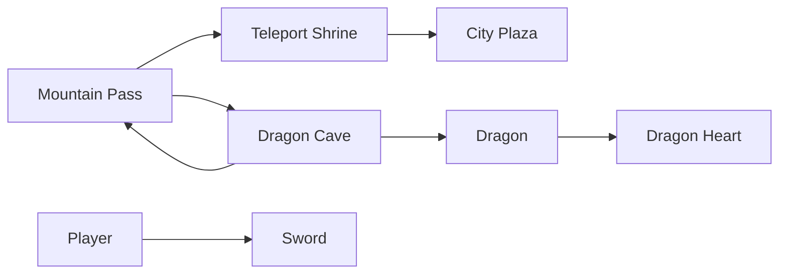
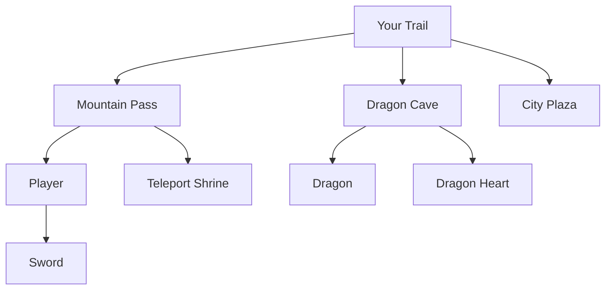

# Creation Guide

 This page is a teaching guide for building a small playable story in the O'RuggEd editor.

## Overview 

TheO'RuggEdson goal is to help you understand how a complete O'RuggEd scenario is authored from reusable ECS-style parts. By the end of the lesson, the learner should be able to build a short interactive sequence in which:

- the player arrives in the mountains
- a teleport exists but is initially inactive
- the player picks a sword
- the player enters a cave
- the player uses a sword to defeat a dragon
- the player obtains a dragon heart
- the player returns to the mountains
- the player uses the dragon heart to activate the teleport
- the player reaches the city

## Learning Objectives

After completing this lesson, a learner should understand:  

1. how rooms are authored with `Entity`, `Area`, `Reactable`, and `DescriptionText`
2. how movement is authored with `Exit`
3. how carried objects are modeled with `InventoryItem` and `Container`
4. how the editor hierarchy represents world placement and containment
5. how `Action`, `Trigger`, `Condition`, and `Effect` work together to create story logic
6. how a small puzzle or combat sequence can be built from reusable components rather than custom code

## The Big Idea

This lesson is not only about making a dragon scene. It is about learning the O'RuggEd authoring model.

In O'RuggEd:

- an `Entity` is the object identity
- components add capabilities
- hierarchy determines where things are
- descriptions control what the player reads
- actions control what changes when the player interacts

That means the story is built by composing pieces, not by writing one large scripted event.

  
## Story Diagram

  

  

## Why This Lesson Works Well

This scenario is a good teaching example because it demonstrates several core patterns in one small build:

- room creation
- movement between areas
- visible versus hidden world objects
- a carried item used on a target
- a defeated-state transformation
- a second item-based puzzle
- a final transition to a new location

## Prerequisites

Before starting, you will need to have:

- access to the editor
- a trail they can edit
- permission to publish changes
- basic familiarity with selecting entities and adding components

Keep all authored entities in the same trail for this lesson.

  
## Final World Structure

The target structure should look like this:

  

  

With the idea clear, lets start with [[Lesson 1]].

